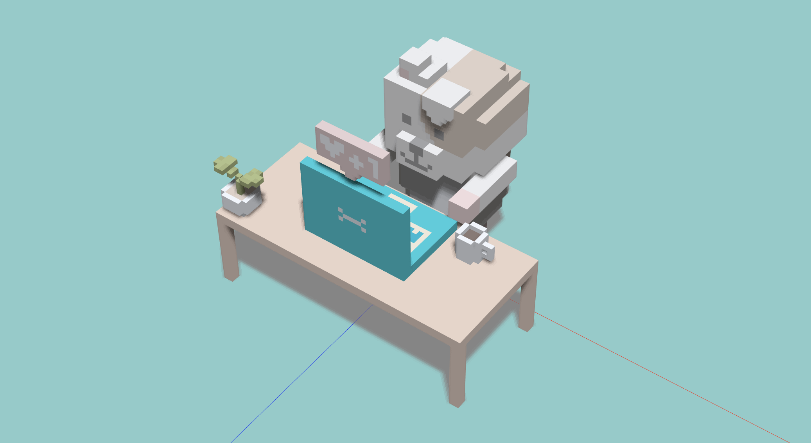
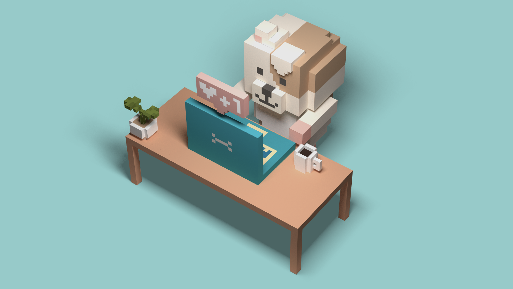

# Voxel Dog using three.js

A 3D dog model rendered with three.js for reproducing the MagicaVoxel's soft shadows.

This project includes 3 rendering examples.

## 1. Wavefront OBJ

It loads `.obj` and `.mtl` files that are exported from MagicaVoxel, using `OBJLoader2` and `MTLLoader`.
It doesn't produce any shadows out of the box, so it looks so flat.

## 2. Percentage closer soft shadows

It renders soft shadows dynamically using a PCSS shader.
It works well but its performance is not well, expecially on mobile devices.
Besides, the shadows are a bit shaggy.

## 3. Baked textures

The shadows are baked with Cycle engine of Blender beforehand, so the rendering performance can be significantly improved.
It achieves the beautiful soft shadows just like MagicaVoxel renderer!
But as a result, the glTF file size got quite large due to the high quality textures.

---

© [Takuya Matsuyama](https://www.craftz.dog/). MIT License.
